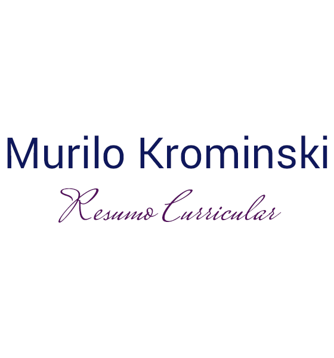

  
⠀⠀⠀⠀⠀⠀⠀⠀⠀       
  

  
  

## Apresentação de Murilo Krominski: 
Prezados Recrutadores,

Em janeiro de 2021 eu voltarei ao Brasil depois de um período de mais de dois anos vivendo na Europa.
Por acreditar que minhas experiências, perfil e formação possam ser de interesse para a vossa empresa, eu gostaria de apresentar-lhes alguns dos principais modos em que poderei vir colaborar com os objetivos de vossa organização.

Tenho domínio sobre as mais recentes e avançadas técnicas e ferramentas para transformação de dados brutos em informações significativas, algo imprescindível para tomadas de decisões importantes de forma efetiva, segura e bem fundamentada, além de poder identificar, monitorar, desenvolver, e até mesmo criar novas oportunidades internas e de estratégias de negócios com vantagem competitiva e estabilidade a longo prazo para o vosso negócio.

Nos últimos anos eu vivi no maior polo tecnologico da Itália, e também nas duas principais cidades de Portugal.
Neste período, tenho participado de treinamentos e eventos por grandes empresas, como IBM, Google, Relayr, DriverlessAI (H2OAI), Logoplaste, Erising, e também por instituições de ensino e associações de profissionais, relacionados a integração de novas tecnologias com metodologias de gestão de empresas, Smart Manufacturing, Business Intelligence, e Industria 4.0.
Além de ser cidadão Brasileiro, eu também conquistei o reconhecimento de uma cidadania europeia, no caso a Italiana (uma das melhores do mundo no âmbito de possuir livre acesso a outros países), também consegui o reconhecimento de diversas certificações, além das quais eu obtive nesse período, como pela Google Itália que me concedeu uma certificação em Marketing.

Participei da Maratona Behind the Code da IBM, chegando até a última fase com 8 projetos concluídos com o Watson da IBM, para as empresas Cocamar, UNINASSAU, FIAP, Algar, Tecban, LIT, TNT e Fiat Chrysler Automobiles, usando as tecnologias mais disruptivas do mercado como Inteligência Artificial, BigData, Cloud, Visual Recognition, Machine Learning, Containers e IoT, para encontrar a resolução de problemas gerenciais, de inteligência e técnicos dessas empresas.

Participação no Hackathon Empreenda Getnet, com o objetivo de conhecer / criar soluções que ajudem a potencializar a receita das pequenas e médias empresas, hoje responsáveis por 30% do PIB brasileiro.

Possuo acesso a centenas de ferramentas de gestão empresarial (muitos de forma vitalícia), como pela IBM Cloud, Amazon Web Services, Google Cloud, Microsoft Azure, Microsoft 360, etc.

Sou Especialista (lato sensu) em Administração de Empresas, pela FGV - Fundação Getúlio Vargas; constantemente eleita em primeiro lugar, em toda a América Latina, como a única instituição privada brasileira entre as 100 melhores do mundo para a minha área de especialização.

Sou graduado em Engenharia de Controle e Automação, com registro no CREA, além de ser técnico em Mecatrônica Industrial, e devido aos muitos certificados e experiências, também reconhecido em outras áreas como Qualidade, Informática, Marketing e Finanças.

Minhas experiências profissionais e formação acadêmica abrangem áreas administrativas e técnicas, o que me permitem manter uma visão integrada de processos de áreas diferentes em minhas análises e decisões, e acredito que isto venha de encontra aos interesses de vossa empresa para decisões estratégicas.

Entre as atividades que emprego ou já empreguei, se encontram a atuação como gestor, auditor e consultor de “Sistemas da Qualidade”, principalmente em fornecedores; coordenação de pequenas equipes técnicas e administrativas; otimização de processos diversos com automação e desenvolvimento de sistemas de controle; atuação direta com resolução de problemas de logística, qualidade, engenharia, marketing, vendas, etc.
Fui o autor de uma planilha de controle em Excel com VBA, que na ocasião substituiu o padrão mundial na Valeo Group, no programa de SPPC (Special Product and Process Characteristics).
Realizei um estudo que levou a resolução de um problema técnico que perdurava anos, no setor de embalagens da Amend Cosméticos.
Conheci praticamente todos os departamentos e seus desdobramentos de atividades, dentro de empresas de pequeno, médio e grande porte, nacionais ou multinacionais.

Atualmente atuando profissionalmente como Gestor Comercial / Gestor de Clientes pela ManpowerGroup Solutions representando a NOS, Especialista Imobiliário pela RE/MAX.

Apto a resolver problemas e fazer bons negócios, busco oportunidade administrativa, comercial, executiva ou técnica; busco somar minhas afinidades para principal atuação em áreas organizacionais e estratégicas, estando aberto a propostas de qualquer âmbito em qualquer Cidade ou Estado.

Segue em anexo, uma cópia do meu resumo curricular.

Atenciosamente,

Murilo Krominski

<h1>Resumo Curricular de Murilo Krominski</h1>

 Curriculum Vitae simplificado em PDF via Google Drive: http://bit.ly/31aSyqF 

Cidadanias Italiana e Brasileira | Documentado em vários países, como Brasil, Itália e Portugal. 
Atualmente estou a viver na cidade do Porto, em Portugal, com <b>disponibilidade total para mudanças, inclusive internacionais</b>. 
31 anos | Solteiro | murilokr@gmail.com | murilo.krominski@fgv.edu.br | <a href="http://www.linkedin.com/in/murilokrominski">linkedin.com/in/murilokrominski</a> | <a href="https://wa.me/+351-913169801">+351 913 169 801</a>

<h2>Objetivo:</h2>
Apto a resolver problemas e fazer bons negócios, busco oportunidade administrativa, comercial, executiva ou técnica; disposto a analisar propostas.

<h2>Perfil Profissional:</h2>
Possuo aptidões para negócios, tecnologias, pessoas e processos; potencializadas por uma ampla formação, com mais de 30 certificações, integradas com práticas profissionais que englobam todos os departamentos de uma empresa. 
Atualizado com as últimas tecnologias e métodos de resoluções de problemas em Business Intelligence.

<h2>Escolaridade (compêndio com as principais):</h2>
•	<b>Especialização - Administração de Empresas (lato sensu):</b> 
FGV Management (Fundação Getúlio Vargas), São Paulo, Brasil: 2014 - 2015.
TOP 1 América Latina / TOP 9 Think Tank Worldwide / TOP 100 Global Management (única privado-brasileira).
  
•	<b>Graduação - Engenharia de Controlo e Automação (bacharelado):</b>
UniABC (Universidade do Grande ABC), São Paulo, Brasil: 2009 - 2013.
Registro no CONFEA / CREA (Brasil), OE (Portugal) / FEANI (União Europeia).

<h2>Idiomas:</h2>
<b>Português</b> (fluente C2), <b>Italiano</b> (proficiente C1), <b>Inglês</b> (avançado B2, em breve C1), <b>Espanhol</b> (intermediário B1).

<h2>Principais Certificações e Licenças (compêndio com as principais):</h2>
<b>Auditoria / Consultoria / Gestão de Qualidade:</b> 5W2H; APQP (Planeamento Avançado da Qualidade do Produto); Estatística; FMEA (Análise de Modo e Efeitos de Falha Potencial); FTA; ISO 9001; ISO/TS 16949; Kaisen; LLC; MSA (Análise dos Sistemas de Medição); QRQC-PDCA-SDCA-FTA (Resposta Rápida do Controle de Qualidade da Valeo).   

<b>Automação / Controle / Engenharia / Inteligência de Dados / Linguagens de Máquinas:</b> Arduíno; Assembly (MPLAB Microchips PIC); C++; Ladder (PLC); Rede de Petri; Macros e VBA (Excel); Object Pascal (Delphi); UserRPL / SysRPL.  

<b>Gestão de Negócios / Legal / Logística / Marketing / Recursos Humanos / Vendas:</b> Calculadora Financeira HP 12C; Dropshipping; Economia; Gerenciamento de Projetos Valeo / Processos Administrativos e Produtivos; Marketing Digital by Google Italy (credenciado IAB Europe); Modernização Administrativa em Recursos Humanos; Patentes e Bases; Planeamento / Gestão de Vendas; Power Searching with Google; Reforma Ortográfica BR/PT; Vendedor Profissional.  

<b>A Cursar:</b> Financial Analyst Training, Investing and Master of Business Administration Course com Chris Haroun;
Python (com Data Science, Machine Learning e Inteligência Artificial).  

<h2>Histórico Profissional (compêndio com as principais):</h2>
<b>•	Gestor Comercial / Gestor de Clientes, ManpowerGroup Solutions / NOS</b>, Portugal, 02/2020 - Pausado.  
Desenvolvimento e aplicação de estratégias comerciais (individuais e coletivas), a garantir apresentações persuasivas e personalizadas, a resultar em angariações / prospeções de clientes em sempre bons negócios, com feedback diário.   

<b>•	Consultor Imobiliário, RE/MAX</b>, Portugal, 11/2019 - Atual.  
Estudos de Mercado; Qualificação de imóveis, pessoas e negócios; Planos de Marketing Estratégico de ampla difusão; Animação computadorizada; Negociação e contratos com clientes e/ou parceiros (Confidencial Imobiliário, Google Earth Engine, Idealista, MAXFINANCE, Melom Obras, OEC, REATIA); I.A; Robôs de Dados; Vendas e Arrendamentos, etc.  

<b>•	Consultor de Trade Marketing, Presencial e/ou Virtual</b>, Mundial, 08/2013 - Atual.  
Cases de Sucesso com 4.5M de inscritos; Autor de “Estratégias do Marketing 3.0”, pela FGV; free-lancer, etc.  

<b>•	Gerente Administrativo, Novidades Modas - Fashion Store</b>, SP, Brasil, 01/2014 - 07/2018.  
Gerenciamento e estruturação do Business Plan, a gerar crescimento de receitas, perceção de valor e fidelização, etc.  

<b>•	Desenvolvedor de Sistema Informático, Quero Agregar - Negócio Digital</b>, Brasil, 03/2015 - 02/2016.  
Desenvolvi um sistema informático integrado com plataformas Cloud Computing, para “Angariar Cargas” para transporte de cargas privados, para integrar profissionais autônomos a empresas de logística com baixo custo, etc.  

<b>•	Analista da Garantia da Qualidade / Auditor, Amend Cosméticos - Multinacional</b>, SP, Brasil, 01/2013 - 06/2013.  
Planejamento, implementação e monitoramento de processos relacionados com Qualidade; sendo o responsável pelo departamento de “Garantia da Qualidade” e corresponsável pela coordenação dos departamentos de controle de “Qualidade de Embalagens” e “Qualidade Físico-Químico-Microbiológico”, juntamente com o Supervisor Geral.
Responsável pela realização de auditorias em fornecedores e terceiristas, de homologação ou acompanhamento; responsável pela elaboração e gerenciamento dos “Planos de Auditorias” e relatórios.
Responsável pela gestão do “Processo de Qualificação e Avaliação de Fornecedores”, “Indicadores de Desempenho” e ferramentas de apoio e gestão, através de “Contrato Comercial”, “Manual para Fornecedor Amend”, “ABNT NBR ISO 9001:2008”, “Portaria ANVISA 348/97” e “Boas Práticas de Fabricação”.
Elaboração e aplicação de estudos técnicos de engenharia, de interação com fornecedores e demais áreas da organização, para solução de problemas em produtos, materiais e processos, melhorando a qualidade e a produtividade.
Criação de um software integrado ao Excel (avançado), em VBA, para registro de dados de entrada de produtos, no ato do recebimento. "Banco de Dados" gerando “planos de ações” para controles; principalmente dos departamentos: PCP, Suprimentos, Compras e Qualidade; monitorados em tempo real.
Estudos e definições de NQA's (Nível de Qualidade Assegurada), para latas decorativas, rotulagem, gravação de frascos; criação de formulários de inspeção por amostragem - Normas NBR 5426 e 5429.
Criação de “Books de Defeitos” para terceiristas e uso fabril, bem como de “Instruções de Trabalho”.
Responsável pela implementação do “Módulo da Qualidade - Inspeção de Recebimento” do software Microsiga Protheus; desde criação, validação de fluxos e coordenação dos responsáveis pelo cadastramento de dados.
Apoio à Gerência Industrial na elaboração e desdobramento do “Planejamento Estratégico da Fábrica”.
Implementação e gestão do “Processo de Controle de Não Conformidades”.
Elaboração de Materiais de Apoio para diversos departamentos (apresentações, apostilas, etc.) e realização de treinamentos técnicos, de conscientização e capacitação.
Participações técnicas, em pesquisas e desenvolvimentos (engenharia) de novos produtos. 

<b>•	Trainee - Engenheiro de Qualidade, Valeo Automotive Systems - Multinacional</b>, SP, Brasil, 01/2011 - 10/2012.  
Elaboração e gerenciamento de QRQC's (“Resposta rápida do Controle de Qualidade”) para fornecedores e clientes nacionais e internacionais; somados a processos de auditoria interna e de práticas de qualidade nos clientes (tratativas de problemas de Qualidade / Engenharia / Garantia via e-mail, telefone ou visitas técnicas).
Aprimorei o Sistema de Qualidade SPPC (Special Product and Process Characteristics) mundial da Valeo.
Básico com IMDS e MPLM (Eng. Produto); responsável pelos trabalhos com YIS e controle de SPPC’s.
Coordenação das equipes de retrabalho; garantindo a continuidade nas linhas e segregação de falhas.
Participação diária nas reuniões de Produção (UAP), Qualidade de Fornecedores, e de Garantia.
Utilização do programa SAP para levantamento de dados para gerenciamento da Qualidade e Logística.
Acompanhamento de componentes em linha de montagem e elaboração de IT's (Instrução de trabalho).
Manutenção, bem como a criação e revisão de “Books de defeitos” para o Logan (Renault) e Tutoriais.
Análises em amostras de itens com suspeita de problemas de qualidade; gerando todos os relatórios.
Tradução de documentos / e-mails, e elaboração de modelos de cartas nacionais e internacionais.
Cálculos e repasse de custos de “Não Qualidade” para fornecedores.
Responsável dos feedbacks de “Qualidade” para a Renault (Argentina) e Volkswagen (Taubaté).
Corresponsável pelas visitas técnicas de Garantia: Man (Resende), CTG Ford (Barueri) e CTG Man (Santo André).

<b>•	Técnico da Qualidade / Assistente de Laboratório / Estagiário de Eletrônica, Piu Telecom</b>, SP, Brasil 11/2007 - 04/2009.
Coordenação do "Setor de Qualidade", auxiliando o Supervisor Geral, criando sistema de análise de dados eficiente.
Responsável pela formação de cada membro da Qualidade e treinamento de assistentes técnicos e estagiários.
Realizei várias funções, tais como: Desenvolvi software de computador em 'Delphi', que acelerou imensamente a criação e reparo de rótulos para dispositivos celulares com tecnologias CDMA e TDMA.
Realizei testes e reparos em aparelhos novos e semi-novos de todas as tecnologias e fabricantes (eletrônica).
Fui recomendado pela Instituiçao de Ensino.

<b>Outras empresas e experiências…</b>  
